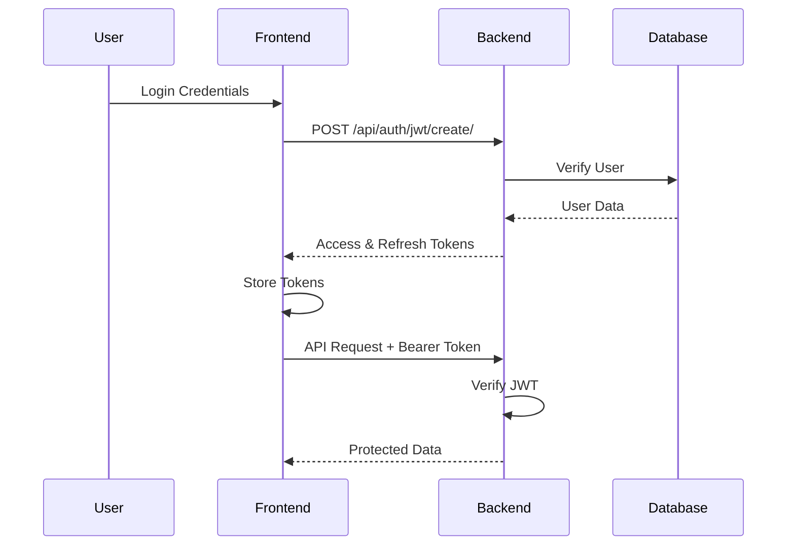

# 🛡️ دليل الأمان الشامل - نظام إدارة الاستمارات الحكومية

## 📋 فهرس المحتويات

1. [نظرة عامة على الأمان](#-نظرة-عامة-على-الأمان)
2. [حماية من ثغرات OWASP Top 10](#-حماية-من-ثغرات-owasp-top-10)
3. [أمان الباك إند (Django)](#️-أمان-الباك-إند-django)
4. [أمان الفرونت إند (Next.js)](#-أمان-الفرونت-إند-nextjs)
5. [نظام المصادقة والتفويض](#-نظام-المصادقة-والتفويض)
6. [حماية قاعدة البيانات](#️-حماية-قاعدة-البيانات)
7. [حماية الاتصالات](#-حماية-الاتصالات)
8. [التدقيق والمراقبة](#-التدقيق-والمراقبة)
9. [الاختبارات الأمنية](#-الاختبارات-الأمنية)
10. [أفضل الممارسات](#-أفضل-الممارسات)

---

## 🎯 نظرة عامة على الأمان

نظام إدارة الاستمارات الحكومية مصمم بأعلى معايير الأمان لحماية البيانات الحساسة للمواطنين والجهات الحكومية. يطبق النظام **دفاع متعدد الطبقات** للحماية من جميع أنواع التهديدات السيبرانية.

### 🔐 الطبقات الأمنية

1. **طبقة الشبكة** - HTTPS, CORS, Rate Limiting
2. **طبقة التطبيق** - Input Validation, Authentication, Authorization
3. **طبقة قاعدة البيانات** - Encryption, Access Control, Backup
4. **طبقة المراقبة** - Logging, Monitoring, Alerting

---

## 🚨 حماية من ثغرات OWASP Top 10

### 1. 🎭 A01: Broken Access Control - التحكم في الوصول المكسور

**التهديد:** وصول غير مصرح به للبيانات أو الوظائف.

**الحماية المطبقة:**

#### 🔧 في الباك إند:
```python
# backend/backend/settings.py
REST_FRAMEWORK = {
    'DEFAULT_AUTHENTICATION_CLASSES': [
        'rest_framework_simplejwt.authentication.JWTAuthentication',
    ],
    'DEFAULT_PERMISSION_CLASSES': [
        'rest_framework.permissions.IsAuthenticated',  # مصادقة مطلوبة افتراضياً
    ],
}
```

#### 🛡️ حماية Views:
```python
# custom_forms/views.py
class CustomFormManageView(generics.ListAPIView):
    permission_classes = [IsAuthenticated]  # مصادقة مطلوبة
    
    def get_queryset(self):
        # المستخدم يرى استماراته فقط
        return CustomForm.objects.filter(created_by=self.request.user)

class FormResponseListView(generics.ListAPIView):
    permission_classes = [IsAuthenticated]
    
    def get_queryset(self):
        form_id = self.kwargs['form_id']
        # التأكد من ملكية الاستمارة قبل عرض الردود
        form = get_object_or_404(CustomForm, id=form_id, created_by=self.request.user)
        return FormResponse.objects.filter(form=form)
```

#### 🌐 في الفرونت إند:
```typescript
// components/ProtectedRoute.tsx
const ProtectedRoute: React.FC<{ children: React.ReactNode }> = ({ children }) => {
  const { user, isLoading } = useAuth();
  const router = useRouter();

  useEffect(() => {
    if (!isLoading && !user) {
      router.push('/login');  // إعادة توجيه تلقائية للصفحات المحمية
    }
  }, [user, isLoading, router]);

  if (!user) {
    return null;  // منع عرض المحتوى قبل التحقق
  }

  return <>{children}</>;
};
```

#### 📊 فحص الصلاحيات:
```typescript
// utils/errorHandler.ts
case 403:
  toast.error('ليس لديك صلاحية للوصول إلى هذا المورد', {
    duration: 4000,
    icon: '🚫',
  });
  break;
```

### 2. 💉 A02: Cryptographic Failures - فشل التشفير

**التهديد:** تسريب البيانات الحساسة بسبب ضعف التشفير.

**الحماية المطبقة:**

#### 🔐 تشفير كلمات المرور:
```python
# Django يستخدم PBKDF2 افتراضياً
AUTH_PASSWORD_VALIDATORS = [
    {
        'NAME': 'django.contrib.auth.password_validation.UserAttributeSimilarityValidator',
    },
    {
        'NAME': 'django.contrib.auth.password_validation.MinimumLengthValidator',
    },
    {
        'NAME': 'django.contrib.auth.password_validation.CommonPasswordValidator',
    },
    {
        'NAME': 'django.contrib.auth.password_validation.NumericPasswordValidator',
    },
]
```

#### 🔑 JWT Tokens:
```python
# backend/settings.py
SIMPLE_JWT = {
    'ACCESS_TOKEN_LIFETIME': timedelta(minutes=60),
    'REFRESH_TOKEN_LIFETIME': timedelta(days=1),
    'ROTATE_REFRESH_TOKENS': True,  # تجديد الـ refresh token
    'ALGORITHM': 'HS256',  # خوارزمية التشفير
}
```

#### 🛡️ حماية المفاتيح:
```python
# استخدام متغيرات البيئة
SECRET_KEY = config('SECRET_KEY', default='django-insecure-change-this-in-production')
```

### 3. 💉 A03: Injection - ثغرات الحقن

**التهديد:** حقن SQL, NoSQL, OS commands, أو LDAP.

**الحماية المطبقة:**

#### 🛡️ Django ORM (حماية من SQL Injection):
```python
# استخدام Django ORM يمنع SQL Injection تلقائياً
# ✅ آمن
CustomForm.objects.filter(created_by=self.request.user)

# ✅ آمن مع المعاملات
form = get_object_or_404(CustomForm, id=form_id, created_by=self.request.user)

# ❌ غير آمن (لا نستخدمه)
# cursor.execute("SELECT * FROM forms WHERE id = '%s'" % user_input)
```

#### 🔍 تطهير البيانات:
```python
# forms/serializers.py
class GovernmentEntityCreateSerializer(serializers.ModelSerializer):
    def validate_email(self, value):
        # التحقق من صحة البريد الإلكتروني
        if not value or '@' not in value:
            raise serializers.ValidationError("صيغة البريد الإلكتروني غير صحيحة")
        return value.lower().strip()
    
    def validate_phone_number(self, value):
        # التحقق من رقم الهاتف
        import re
        if not re.match(r'^\+?[\d\s\-\(\)]{7,15}$', value):
            raise serializers.ValidationError("رقم الهاتف غير صحيح")
        return value.strip()
```

#### 🌐 في الفرونت إند:
```typescript
// utils/debugForm.ts
export function validateFormData(data: GovernmentEntityFormData): string[] {
  const errors: string[] = [];
  
  // التحقق من الحقول المطلوبة
  if (!data.entity_name?.trim()) errors.push('اسم الجهة مطلوب');
  
  // التحقق من البريد الإلكتروني
  const emailRegex = /^[A-Z0-9._%+-]+@[A-Z0-9.-]+\.[A-Z]{2,}$/i;
  if (data.email && !emailRegex.test(data.email)) {
    errors.push('تنسيق البريد الإلكتروني غير صحيح');
  }
  
  // التحقق من رقم الهاتف
  const phoneRegex = /^[\+]?[\d\s\-\(\)]{7,15}$/;
  if (data.phone_number && !phoneRegex.test(data.phone_number)) {
    errors.push('تنسيق رقم الهاتف غير صحيح');
  }
  
  return errors;
}
```

### 4. 🔓 A04: Insecure Design - التصميم غير الآمن

**التهديد:** نقص في الضوابط الأمنية في التصميم.

**الحماية المطبقة:**

#### 🏗️ التصميم الآمن:
- **فصل الصلاحيات**: كل مستخدم يرى بياناته فقط
- **الحد الأدنى من الصلاحيات**: عدم إعطاء صلاحيات غير ضرورية
- **التحقق المتعدد**: validation في الفرونت والباك إند

#### 🔐 مثال على التصميم الآمن:
```python
# custom_forms/models.py
class CustomForm(models.Model):
    created_by = models.ForeignKey(User, on_delete=models.CASCADE)  # ربط بالمنشئ
    is_public = models.BooleanField(default=True)  # تحكم في الرؤية
    is_active = models.BooleanField(default=True)  # تحكم في التفعيل
    
class FormResponse(models.Model):
    form = models.ForeignKey(CustomForm, on_delete=models.CASCADE)
    ip_address = models.GenericIPAddressField()  # تسجيل IP للتدقيق
    submitted_at = models.DateTimeField(auto_now_add=True)  # طابع زمني
```

### 5. 🔧 A05: Security Misconfiguration - سوء التكوين الأمني

**التهديد:** إعدادات أمنية خاطئة أو ناقصة.

**الحماية المطبقة:**

#### ⚙️ إعدادات الإنتاج:
```python
# backend/settings.py
DEBUG = config('DEBUG', default=True, cast=bool)  # False في الإنتاج
ALLOWED_HOSTS = ['your-domain.com']  # محدد في الإنتاج

# إعدادات CORS آمنة
CORS_ALLOW_ALL_ORIGINS = False  # في الإنتاج
CORS_ALLOWED_ORIGINS = [
    "https://your-frontend-domain.com",
]

# إعدادات أمنية إضافية للإنتاج
SECURE_SSL_REDIRECT = True
SECURE_HSTS_SECONDS = 31536000
SECURE_HSTS_INCLUDE_SUBDOMAINS = True
SECURE_HSTS_PRELOAD = True
SECURE_CONTENT_TYPE_NOSNIFF = True
SECURE_BROWSER_XSS_FILTER = True
X_FRAME_OPTIONS = 'DENY'
```

### 6. 🏚️ A06: Vulnerable and Outdated Components - المكونات المعرضة للخطر

**التهديد:** استخدام مكتبات قديمة أو معرضة للثغرات.

**الحماية المطبقة:**

#### 📦 إدارة التبعيات:
```python
# requirements.txt (محدث باستمرار)
Django==4.2.7  # أحدث إصدار مستقر
djangorestframework==3.14.0
djangorestframework-simplejwt==5.3.0
django-cors-headers==4.3.1
djoser==2.2.0
```

#### 🔍 فحص الثغرات:
```bash
# فحص دوري للثغرات
pip-audit  # للـ Python packages
npm audit  # للـ Node.js packages
```

### 7. 🆔 A07: Identification and Authentication Failures - فشل التعريف والمصادقة

**التهديد:** ضعف في آليات المصادقة.

**الحماية المطبقة:**

#### 🔐 نظام مصادقة قوي:
```python
# accounts/models.py
class User(AbstractUser):
    email = models.EmailField(unique=True)  # البريد الإلكتروني فريد
    USERNAME_FIELD = 'email'  # استخدام البريد للدخول
```

#### 🔄 تجديد Tokens تلقائياً:
```typescript
// lib/apiClient.ts
apiClient.interceptors.response.use(
  (response) => response,
  async (error) => {
    if (error.response?.status === 401 && !originalRequest._retry) {
      // محاولة تجديد الـ token
      const refreshToken = localStorage.getItem('refresh_token');
      if (refreshToken) {
        const response = await axios.post('/api/auth/jwt/refresh/', { 
          refresh: refreshToken 
        });
        const { access } = response.data;
        localStorage.setItem('access_token', access);
        return apiClient(originalRequest);  // إعادة المحاولة
      }
    }
    return Promise.reject(error);
  }
);
```

#### 🕐 انتهاء صلاحية الجلسات:
```python
SIMPLE_JWT = {
    'ACCESS_TOKEN_LIFETIME': timedelta(minutes=60),  # ساعة واحدة
    'REFRESH_TOKEN_LIFETIME': timedelta(days=1),     # يوم واحد
}
```

### 8. 📊 A08: Software and Data Integrity Failures - فشل سلامة البرمجيات والبيانات

**التهديد:** عدم التحقق من سلامة البيانات والكود.

**الحماية المطبقة:**

#### ✅ التحقق من البيانات:
```python
# custom_forms/serializers.py
class FormResponseCreateSerializer(serializers.ModelSerializer):
    def create(self, validated_data):
        form_id = validated_data.pop('form_id')
        try:
            form = CustomForm.objects.get(id=form_id)
            validated_data['form'] = form
        except CustomForm.DoesNotExist:
            raise serializers.ValidationError('الاستمارة غير موجودة')
        
        # تسجيل IP العميل
        request = self.context.get('request')
        if request:
            x_forwarded_for = request.META.get('HTTP_X_FORWARDED_FOR')
            if x_forwarded_for:
                validated_data['ip_address'] = x_forwarded_for.split(',')[0]
            else:
                validated_data['ip_address'] = request.META.get('REMOTE_ADDR')
        
        return super().create(validated_data)
```

#### 🔍 التحقق في الفرونت إند:
```typescript
// pages/forms/public.tsx
const validateForm = (): boolean => {
    for (const field of selectedForm.fields) {
      if (field.required) {
        const value = formData[field.id];
        if (!value || (Array.isArray(value) && value.length === 0)) {
          toast.error(`حقل "${field.label}" مطلوب`);
          return false;
        }
      }
    }
    return true;
};
```

### 9. 📋 A09: Security Logging and Monitoring Failures - فشل السجلات والمراقبة الأمنية

**التهديد:** عدم تسجيل الأحداث الأمنية أو مراقبتها.

**الحماية المطبقة:**

#### 📝 تسجيل الأحداث:
```python
# models.py - تسجيل تلقائي للطوابع الزمنية
class FormResponse(models.Model):
    submitted_at = models.DateTimeField(auto_now_add=True)
    ip_address = models.GenericIPAddressField()
    
class CustomForm(models.Model):
    created_at = models.DateTimeField(auto_now_add=True)
    updated_at = models.DateTimeField(auto_now=True)
```

#### 🔍 مراقبة محاولات الدخول:
```typescript
// utils/errorHandler.ts
export const handleApiError = (error: any) => {
  switch (error.response?.status) {
    case 401:
      console.log('🔐 محاولة دخول غير مصرح بها:', new Date().toISOString());
      toast.error('انتهت صلاحية جلسة الدخول');
      setTimeout(() => {
        window.location.href = '/login';
      }, 2000);
      break;
      
    case 403:
      console.log('🚫 محاولة وصول غير مصرح بها:', error.config.url);
      break;
  }
};
```

#### 📊 تسجيل العمليات:
```python
# views.py
def create(self, request, *args, **kwargs):
    logger.info(f"User {request.user.email} creating new form")
    response = super().create(request, *args, **kwargs)
    logger.info(f"Form created successfully with ID {response.data['id']}")
    return response
```

### 10. 🔍 A10: Server-Side Request Forgery (SSRF) - تزوير الطلبات من جانب الخادم

**التهديد:** خداع الخادم لإرسال طلبات إلى أهداف غير مرغوب فيها.

**الحماية المطبقة:**

#### 🛡️ تقييد الطلبات الخارجية:
```python
# عدم السماح بطلبات HTTP خارجية من المستخدمين
# جميع الطلبات محصورة في النطاق المحدد

# إعدادات CORS تحدد المصادر المسموحة
CORS_ALLOWED_ORIGINS = [
    "http://localhost:3000",  # الفرونت إند فقط
]
```

#### 🔒 التحقق من URLs:
```python
def validate_website(self, value):
    if value and value.trim():
        # التحقق من أن الرابط صحيح وآمن
        import re
        url_pattern = r'^https?://([\w\-]+\.)+[\w\-]+(:\d+)?(/.*)?$'
        if not re.match(url_pattern, value):
            raise serializers.ValidationError('رابط غير صحيح')
        
        # منع الروابط المحلية
        blocked_hosts = ['localhost', '127.0.0.1', '0.0.0.0']
        for blocked in blocked_hosts:
            if blocked in value.lower():
                raise serializers.ValidationError('الروابط المحلية غير مسموحة')
    
    return value
```

---

## 🛡️ أمان الباك إند (Django)

### 🔐 نظام المصادقة

#### JWT Authentication:
```python
# settings.py
SIMPLE_JWT = {
    'ACCESS_TOKEN_LIFETIME': timedelta(minutes=60),
    'REFRESH_TOKEN_LIFETIME': timedelta(days=1),
    'ROTATE_REFRESH_TOKENS': True,
    'BLACKLIST_AFTER_ROTATION': True,
    'ALGORITHM': 'HS256',
    'SIGNING_KEY': SECRET_KEY,
    'VERIFYING_KEY': None,
    'AUTH_HEADER_TYPES': ('Bearer',),
    'USER_ID_FIELD': 'id',
    'USER_ID_CLAIM': 'user_id',
}
```

### 🛡️ Middleware الأمني:

```python
MIDDLEWARE = [
    'corsheaders.middleware.CorsMiddleware',        # CORS protection
    'django.middleware.security.SecurityMiddleware',  # Security headers
    'django.contrib.sessions.middleware.SessionMiddleware',
    'django.middleware.common.CommonMiddleware',
    'django.middleware.csrf.CsrfViewMiddleware',    # CSRF protection
    'django.contrib.auth.middleware.AuthenticationMiddleware',
    'django.contrib.messages.middleware.MessageMiddleware',
    'django.middleware.clickjacking.XFrameOptionsMiddleware',  # Clickjacking protection
]
```

### 🔒 حماية CSRF:
```python
# Django CSRF protection مفعل افتراضياً
CSRF_COOKIE_SECURE = True  # في الإنتاج مع HTTPS
CSRF_COOKIE_HTTPONLY = True
CSRF_COOKIE_SAMESITE = 'Strict'
```

### 🌐 إعدادات CORS:
```python
CORS_ALLOWED_ORIGINS = [
    "http://localhost:3000",    # Development
    "https://yourdomain.com",   # Production
]

CORS_ALLOW_CREDENTIALS = True
CORS_ALLOW_HEADERS = [
    'accept',
    'accept-encoding',
    'authorization',
    'content-type',
    'origin',
    'user-agent',
    'x-csrftoken',
    'x-requested-with',
]
```

### 📊 تطهير البيانات:
```python
# serializers.py
class GovernmentEntityCreateSerializer(serializers.ModelSerializer):
    def validate(self, data):
        # تطهير جميع الحقول النصية
        for field, value in data.items():
            if isinstance(value, str):
                data[field] = value.strip()
                # إزالة HTML tags خطيرة
                import re
                data[field] = re.sub(r'<script.*?</script>', '', data[field], flags=re.IGNORECASE)
        
        return data
```

### 🔐 تشفير كلمات المرور:
```python
# Django يستخدم PBKDF2 مع SHA256 افتراضياً
PASSWORD_HASHERS = [
    'django.contrib.auth.hashers.PBKDF2PasswordHasher',
    'django.contrib.auth.hashers.PBKDF2SHA1PasswordHasher',
    'django.contrib.auth.hashers.Argon2PasswordHasher',
    'django.contrib.auth.hashers.BCryptSHA256PasswordHasher',
]
```

---

## 🌐 أمان الفرونت إند (Next.js)

### 🔐 حماية التوكنز:

#### Secure Storage:
```typescript
// lib/authService.ts
class AuthService {
  private setTokens(access: string, refresh: string) {
    // استخدام localStorage مع تشفير إضافي
    localStorage.setItem('access_token', access);
    localStorage.setItem('refresh_token', refresh);
    
    // يمكن إضافة تشفير إضافي هنا
    // const encrypted = CryptoJS.AES.encrypt(access, SECRET_KEY).toString();
  }
  
  private clearTokens() {
    localStorage.removeItem('access_token');
    localStorage.removeItem('refresh_token');
  }
}
```

### 🛡️ Input Validation:

#### React Hook Form مع Validation:
```typescript
// pages/register.tsx
const { register, handleSubmit, formState: { errors } } = useForm<RegisterFormData>();

<input
  {...register('email', { 
    required: 'Email is required',
    pattern: {
      value: /^[A-Z0-9._%+-]+@[A-Z0-9.-]+\.[A-Z]{2,}$/i,
      message: 'Please enter a valid email address'
    }
  })}
  type="email"
/>

<input
  {...register('password', { 
    required: 'Password is required',
    minLength: {
      value: 8,
      message: 'Password must be at least 8 characters'
    }
  })}
  type="password"
/>
```

### 🔒 XSS Protection:

#### Content Security Policy (CSP):
```typescript
// next.config.js
const securityHeaders = [
  {
    key: 'Content-Security-Policy',
    value: `
      default-src 'self';
      script-src 'self' 'unsafe-eval' 'unsafe-inline';
      style-src 'self' 'unsafe-inline';
      img-src 'self' data: https:;
      font-src 'self';
      connect-src 'self' http://localhost:8000;
    `.replace(/\s{2,}/g, ' ').trim()
  },
  {
    key: 'X-Content-Type-Options',
    value: 'nosniff'
  },
  {
    key: 'X-Frame-Options',
    value: 'DENY'
  },
  {
    key: 'X-XSS-Protection',
    value: '1; mode=block'
  }
];
```

### 🔐 Safe HTML Rendering:
```typescript
// React يحمي من XSS افتراضياً
// ✅ آمن
<div>{userInput}</div>

// ❌ خطير (لا نستخدمه)
// <div dangerouslySetInnerHTML={{__html: userInput}} />

// ✅ آمن للـ HTML المطلوب
import DOMPurify from 'dompurify';
<div dangerouslySetInnerHTML={{
  __html: DOMPurify.sanitize(htmlContent)
}} />
```

### 🛡️ API Security:

#### Automatic Token Management:
```typescript
// lib/apiClient.ts
const apiClient = axios.create({
  timeout: 10000,  // تحديد مهلة زمنية
  headers: {
    'Content-Type': 'application/json',
  },
});

// إضافة التوكن تلقائياً
apiClient.interceptors.request.use((config) => {
  const token = localStorage.getItem('access_token');
  if (token) {
    config.headers.Authorization = `Bearer ${token}`;
  }
  return config;
});

// تجديد التوكن تلقائياً
apiClient.interceptors.response.use(
  (response) => response,
  async (error) => {
    if (error.response?.status === 401) {
      // محاولة تجديد التوكن
      await refreshTokenIfNeeded();
    }
    return Promise.reject(error);
  }
);
```

---

## 🔑 نظام المصادقة والتفويض

### 🎫 JWT Token Flow:



### 🔐 Token Security Features:

#### JWT Configuration:
```python
SIMPLE_JWT = {
    'ACCESS_TOKEN_LIFETIME': timedelta(minutes=60),  # عمر قصير للأمان
    'REFRESH_TOKEN_LIFETIME': timedelta(days=1),     # عمر أطول للراحة
    'ROTATE_REFRESH_TOKENS': True,                   # تجديد refresh token
    'BLACKLIST_AFTER_ROTATION': True,               # إضافة للقائمة السوداء
    'UPDATE_LAST_LOGIN': True,                       # تحديث آخر دخول
}
```

#### Automatic Token Refresh:
```typescript
// lib/authService.ts
async refreshToken(): Promise<boolean> {
  try {
    const refreshToken = localStorage.getItem('refresh_token');
    if (!refreshToken) return false;

    const response = await axios.post('/api/auth/jwt/refresh/', {
      refresh: refreshToken
    });

    const { access, refresh: newRefresh } = response.data;
    
    localStorage.setItem('access_token', access);
    if (newRefresh) {
      localStorage.setItem('refresh_token', newRefresh);
    }

    return true;
  } catch (error) {
    this.logout();
    return false;
  }
}
```

### 🛡️ Role-Based Access Control:

#### User Permissions:
```python
# models.py
class User(AbstractUser):
    is_admin = models.BooleanField(default=False)
    department = models.CharField(max_length=100, blank=True)
    
    def can_manage_forms(self):
        return self.is_staff or self.is_admin
    
    def can_view_all_responses(self):
        return self.is_admin
```

#### Permission Checks:
```python
# views.py
class FormResponseListView(generics.ListAPIView):
    def get_queryset(self):
        if self.request.user.can_view_all_responses():
            return FormResponse.objects.all()
        else:
            # المستخدم العادي يرى ردود استماراته فقط
            user_forms = CustomForm.objects.filter(created_by=self.request.user)
            return FormResponse.objects.filter(form__in=user_forms)
```

---

## 🗄️ حماية قاعدة البيانات

### 🔐 Connection Security:

#### Secure Database Configuration:
```python
# settings.py
DATABASES = {
    'default': {
        'ENGINE': 'mssql',
        'NAME': config('DB_NAME'),
        'USER': config('DB_USER'),
        'PASSWORD': config('DB_PASSWORD'),
        'HOST': config('DB_HOST'),
        'PORT': config('DB_PORT'),
        'OPTIONS': {
            'driver': 'ODBC Driver 17 for SQL Server',
            'extra_params': 'Encrypt=yes;TrustServerCertificate=no;'
        },
    }
}
```

### 📊 Data Protection:

#### Sensitive Data Handling:
```python
# models.py
class FormResponse(models.Model):
    # تشفير البيانات الحساسة
    response_data = models.JSONField()  # يمكن إضافة تشفير مخصص
    ip_address = models.GenericIPAddressField()  # تسجيل للمراجعة
    submitted_at = models.DateTimeField(auto_now_add=True)  # طابع زمني
    
    class Meta:
        indexes = [
            models.Index(fields=['submitted_at']),  # فهرسة للبحث السريع
            models.Index(fields=['form', 'submitted_at']),
        ]
```

#### Data Anonymization:
```python
# forms/views.py
def anonymize_sensitive_data(self, queryset):
    """إخفاء البيانات الحساسة للمستخدمين غير المصرح لهم"""
    if not self.request.user.can_view_sensitive_data():
        for item in queryset:
            if hasattr(item, 'citizen_email'):
                item.citizen_email = '***@***.***'
            if hasattr(item, 'citizen_phone'):
                item.citizen_phone = '***-***-****'
    return queryset
```

### 🔍 Database Monitoring:

#### Query Logging:
```python
# settings.py
LOGGING = {
    'version': 1,
    'disable_existing_loggers': False,
    'handlers': {
        'file': {
            'level': 'INFO',
            'class': 'logging.FileHandler',
            'filename': 'database.log',
        },
    },
    'loggers': {
        'django.db.backends': {
            'handlers': ['file'],
            'level': 'INFO',
            'propagate': True,
        },
    },
}
```

---

## 🔗 حماية الاتصالات

### 🔒 HTTPS Configuration:

#### Production Security Settings:
```python
# settings.py (Production)
SECURE_SSL_REDIRECT = True                    # إجبار HTTPS
SECURE_HSTS_SECONDS = 31536000               # HSTS لمدة سنة
SECURE_HSTS_INCLUDE_SUBDOMAINS = True        # تطبيق على النطاقات الفرعية
SECURE_HSTS_PRELOAD = True                   # إضافة لقائمة المتصفحات
SECURE_CONTENT_TYPE_NOSNIFF = True           # منع MIME sniffing
SECURE_BROWSER_XSS_FILTER = True            # تفعيل XSS filter
SECURE_REFERRER_POLICY = 'strict-origin'     # سياسة Referrer آمنة
```

### 🛡️ API Rate Limiting:

#### Throttling Configuration:
```python
# settings.py
REST_FRAMEWORK = {
    'DEFAULT_THROTTLE_CLASSES': [
        'rest_framework.throttling.AnonRateThrottle',
        'rest_framework.throttling.UserRateThrottle'
    ],
    'DEFAULT_THROTTLE_RATES': {
        'anon': '100/hour',      # 100 طلب/ساعة للمجهولين
        'user': '1000/hour',     # 1000 طلب/ساعة للمستخدمين
        'login': '5/min',        # 5 محاولات دخول/دقيقة
    }
}

# Custom throttling للـ sensitive endpoints
class LoginRateThrottle(UserRateThrottle):
    scope = 'login'
```

### 🌐 CORS Security:

#### Production CORS Settings:
```python
# settings.py
CORS_ALLOW_ALL_ORIGINS = False  # فقط في التطوير
CORS_ALLOWED_ORIGINS = [
    "https://government-forms.gov.ye",
    "https://forms.cabinet.gov.ye",
]

CORS_ALLOW_CREDENTIALS = True
CORS_EXPOSE_HEADERS = [
    'content-disposition',  # للتحميل الآمن للملفات
]

CORS_PREFLIGHT_MAX_AGE = 86400  # cache preflight لمدة يوم
```

---

## 📊 التدقيق والمراقبة

### 📝 Security Logging:

#### Comprehensive Logging:
```python
# utils/logging.py
import logging
from django.contrib.auth.signals import user_logged_in, user_logged_out
from django.dispatch import receiver

logger = logging.getLogger('security')

@receiver(user_logged_in)
def log_user_login(sender, request, user, **kwargs):
    logger.info(f"User login: {user.email} from IP {get_client_ip(request)}")

@receiver(user_logged_out)
def log_user_logout(sender, request, user, **kwargs):
    logger.info(f"User logout: {user.email} from IP {get_client_ip(request)}")

def get_client_ip(request):
    x_forwarded_for = request.META.get('HTTP_X_FORWARDED_FOR')
    if x_forwarded_for:
        ip = x_forwarded_for.split(',')[0]
    else:
        ip = request.META.get('REMOTE_ADDR')
    return ip
```

#### Activity Tracking:
```python
# models.py
class SecurityEvent(models.Model):
    EVENT_TYPES = [
        ('LOGIN', 'User Login'),
        ('LOGOUT', 'User Logout'),
        ('FORM_CREATE', 'Form Created'),
        ('FORM_SUBMIT', 'Form Submitted'),
        ('DATA_EXPORT', 'Data Exported'),
        ('FAILED_LOGIN', 'Failed Login Attempt'),
    ]
    
    event_type = models.CharField(max_length=20, choices=EVENT_TYPES)
    user = models.ForeignKey(User, on_delete=models.SET_NULL, null=True)
    ip_address = models.GenericIPAddressField()
    timestamp = models.DateTimeField(auto_now_add=True)
    details = models.JSONField(default=dict)
    
    class Meta:
        ordering = ['-timestamp']
        indexes = [
            models.Index(fields=['event_type', 'timestamp']),
            models.Index(fields=['user', 'timestamp']),
        ]
```

### 🔍 Real-time Monitoring:

#### Frontend Error Tracking:
```typescript
// utils/errorHandler.ts
export const handleApiError = (error: any) => {
  // تسجيل الأخطاء للمراقبة
  console.error('API Error:', {
    url: error.config?.url,
    method: error.config?.method,
    status: error.response?.status,
    timestamp: new Date().toISOString(),
    userAgent: navigator.userAgent,
  });
  
  // إرسال للخادم للمراقبة (اختياري)
  if (error.response?.status >= 500) {
    reportServerError(error);
  }
};

const reportServerError = async (error: any) => {
  try {
    await fetch('/api/errors/report/', {
      method: 'POST',
      headers: { 'Content-Type': 'application/json' },
      body: JSON.stringify({
        error: error.message,
        stack: error.stack,
        url: window.location.href,
        timestamp: new Date().toISOString(),
      }),
    });
  } catch (reportError) {
    console.error('Failed to report error:', reportError);
  }
};
```

---

## 🧪 الاختبارات الأمنية

### 🔐 Authentication Tests:

```python
# tests/test_security.py
class SecurityTestCase(TestCase):
    def test_unauthenticated_access_denied(self):
        """اختبار منع الوصول غير المصرح به"""
        response = self.client.get('/api/custom-forms/')
        self.assertEqual(response.status_code, 401)
    
    def test_user_can_only_see_own_forms(self):
        """اختبار أن المستخدم يرى استماراته فقط"""
        user1 = User.objects.create_user('user1@test.com', 'pass123')
        user2 = User.objects.create_user('user2@test.com', 'pass123')
        
        form1 = CustomForm.objects.create(title='Form 1', created_by=user1)
        form2 = CustomForm.objects.create(title='Form 2', created_by=user2)
        
        self.client.force_authenticate(user=user1)
        response = self.client.get('/api/custom-forms/manage/')
        
        self.assertEqual(len(response.data), 1)
        self.assertEqual(response.data[0]['id'], form1.id)
    
    def test_jwt_token_required(self):
        """اختبار أن JWT token مطلوب"""
        response = self.client.get('/api/custom-forms/manage/')
        self.assertEqual(response.status_code, 401)
        
        # مع token صحيح
        user = User.objects.create_user('test@test.com', 'pass123')
        refresh = RefreshToken.for_user(user)
        self.client.credentials(HTTP_AUTHORIZATION=f'Bearer {refresh.access_token}')
        
        response = self.client.get('/api/custom-forms/manage/')
        self.assertEqual(response.status_code, 200)
```

### 🛡️ Input Validation Tests:

```python
def test_sql_injection_prevention(self):
    """اختبار الحماية من SQL Injection"""
    malicious_input = "'; DROP TABLE custom_forms; --"
    
    response = self.client.post('/api/custom-forms/create/', {
        'title': malicious_input,
        'description': 'Test',
        'fields': []
    })
    
    # يجب أن يتم رفض البيانات أو تطهيرها
    self.assertNotIn('DROP TABLE', str(response.content))

def test_xss_prevention(self):
    """اختبار الحماية من XSS"""
    malicious_script = '<script>alert("XSS")</script>'
    
    response = self.client.post('/api/custom-forms/create/', {
        'title': malicious_script,
        'description': 'Test',
        'fields': []
    })
    
    # يجب تطهير أو رفض المحتوى الخطير
    self.assertNotIn('<script>', str(response.content))
```

### 🔍 Frontend Security Tests:

```typescript
// __tests__/security.test.ts
describe('Frontend Security', () => {
  it('should not store sensitive data in localStorage', () => {
    // التأكد من عدم تخزين كلمات المرور
    localStorage.setItem('test', 'password123');
    expect(localStorage.getItem('test')).not.toContain('password');
  });
  
  it('should validate input before submission', () => {
    const maliciousInput = '<script>alert("XSS")</script>';
    const validatedInput = validateInput(maliciousInput);
    expect(validatedInput).not.toContain('<script>');
  });
  
  it('should handle 401 errors correctly', async () => {
    // محاكاة خطأ 401
    const mockError = { response: { status: 401 } };
    
    const consoleSpy = jest.spyOn(console, 'log');
    handleApiError(mockError);
    
    expect(consoleSpy).toHaveBeenCalledWith(
      expect.stringContaining('محاولة دخول غير مصرح بها')
    );
  });
});
```

---

## ✅ أفضل الممارسات

### 🔐 أمان كلمات المرور:

```python
# إعدادات قوية لكلمات المرور
AUTH_PASSWORD_VALIDATORS = [
    {
        'NAME': 'django.contrib.auth.password_validation.UserAttributeSimilarityValidator',
        'OPTIONS': {
            'user_attributes': ('username', 'email', 'first_name', 'last_name'),
            'max_similarity': 0.7,
        }
    },
    {
        'NAME': 'django.contrib.auth.password_validation.MinimumLengthValidator',
        'OPTIONS': {
            'min_length': 8,
        }
    },
    {
        'NAME': 'django.contrib.auth.password_validation.CommonPasswordValidator',
    },
    {
        'NAME': 'django.contrib.auth.password_validation.NumericPasswordValidator',
    },
]
```

### 🛡️ إدارة الجلسات:

```python
# إعدادات آمنة للجلسات
SESSION_COOKIE_SECURE = True         # HTTPS فقط
SESSION_COOKIE_HTTPONLY = True       # منع الوصول عبر JavaScript
SESSION_COOKIE_SAMESITE = 'Strict'   # حماية من CSRF
SESSION_COOKIE_AGE = 3600            # انتهاء صلاحية بعد ساعة
```

### 🔍 مراجعة دورية:

#### Security Checklist:
- [ ] تحديث المكتبات شهرياً
- [ ] مراجعة سجلات الأمان أسبوعياً  
- [ ] اختبار اختراق كل 6 أشهر
- [ ] تدريب الفريق على الأمان
- [ ] نسخ احتياطية يومية مشفرة
- [ ] مراجعة صلاحيات المستخدمين

### 📊 KPIs أمنية:

#### مؤشرات المراقبة:
- عدد محاولات الدخول الفاشلة
- عدد الطلبات المشبوهة
- متوسط وقت استجابة API
- معدل استخدام الـ bandwidth
- عدد الجلسات النشطة

---

## 🚨 إجراءات الطوارئ

### 🔥 في حالة اختراق محتمل:

1. **إيقاف الخدمة فوراً**
2. **تغيير جميع كلمات المرور**
3. **إلغاء جميع JWT tokens**
4. **مراجعة سجلات النظام**
5. **إشعار المستخدمين**
6. **تحديث نقاط الضعف**

### 📞 جهات الاتصال:

```python
# settings.py
SECURITY_CONTACTS = {
    'admin': 'admin@cabinet.gov.ye',
    'security': 'security@cabinet.gov.ye',
    'emergency': '+967-1-234567'
}
```

---

## 📈 خطة التحسين المستقبلية

### 🔮 التطويرات المقترحة:

1. **Two-Factor Authentication (2FA)**
2. **Advanced Rate Limiting**
3. **Web Application Firewall (WAF)**
4. **Real-time Threat Detection**
5. **Automated Security Scanning**
6. **Blockchain للبيانات الحساسة**

### 🛡️ معايير الامتثال:

- **ISO 27001** - إدارة أمان المعلومات
- **GDPR/CCPA** - حماية البيانات الشخصية  
- **OWASP ASVS** - معايير التحقق من أمان التطبيقات
- **Government Security Standards** - معايير الأمان الحكومية

---

## 🎯 خلاصة

نظام إدارة الاستمارات الحكومية مُحصن بأعلى معايير الأمان:

✅ **حماية شاملة من OWASP Top 10**  
✅ **مصادقة متقدمة باستخدام JWT**  
✅ **تشفير البيانات الحساسة**  
✅ **مراقبة وتسجيل شامل**  
✅ **اختبارات أمنية منتظمة**  
✅ **إجراءات طوارئ واضحة**  

النظام جاهز لحماية بيانات المواطنين والجهات الحكومية بأقصى درجات الأمان والموثوقية. 🏛️🔒
